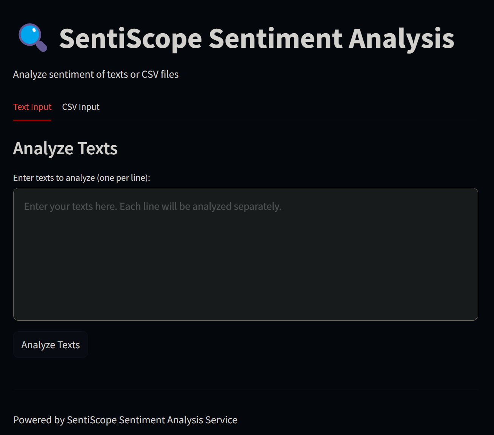

# SentiScope
.png>)
## Project Overview

This project is a highly configurable and modular sentiment analysis pipeline that allows you to process, train, and evaluate models with minimal effort. It is designed to work both as an easy-to-use application for non-developers and as a flexible framework for developers looking to extend the system.

With just a few configurations in a simple `YAML` file, users can start analyzing text data with pre-configured sentiment analysis models. For developers, the project provides the ability to easily add new models or custom modules to the pipeline, all while maintaining a streamlined workflow for tracking experiments with **MLflow**.

Key Features:
- **Customizable Configuration**: Easily modify key parameters such as text column, label column, and others via a configuration file.
- **Flexible Architecture**: Seamlessly integrate new models, preprocessors, or transformers into the system.
- **Seamless MLflow Integration**: Effortlessly track model training and experiments and serving through MLflow.
- **Intuitive User Interface**: A simple, easy-to-use interface built with **Streamlit**, powered by **FastAPI** for sentiment analysis tasks.
- **Automated Artifact Management**: Automatically create and track artifacts at each step of the pipeline.
- **Robust Unit Testing**: Comprehensive unit testing framework for validating components.
- **CI Workflows**: Automated workflows using GitHub Actions for continuous integration.
- **Dockerization for Deployment**: Ready for deployment with Docker, ensuring portability and consistency.
- **Proof of Concept (POC)**: A Jupyter Notebook illustrating the functionality of each project component.
- **Hosted Documentation**: Documentation available on GitHub Pages for easy access and understanding.

---

## Installation Instructions (How to Run SentiScope)


## Prerequisites  
Clone the repository:
    ```sh
    git clone https://github.com/Abdallahelraey/SentiScope.git
    cd SintiScope
    ```
1. **Install Python** (3.11)  
2. **Create a Virtual Environment** (Recommended)  
   ```sh
   python -m venv venv
   venv\Scripts\activate  # On Windows
   ```
3. **Install Dependencies**  
   ```sh
   pip install -r requirements_prod.txt
   ```

---

## Running the Pipeline  

### Run Specific Pipeline Stages  
Use the `main.py` script to execute specific stages of the pipeline.  
Example command:  
```sh
python main.py --stages "Data Ingestion stage" 
```
### Available Stages:  
- `"Data Ingestion stage"`  
- `"Data Profiling stage"`  
- `"Data Transformation stage"`  
- `"Modeling Baseline stage"`  
- `"Advanced Modeling stage"`  
- `"Baseline Inferance stage"`

---

### **Track the Pipeline in MLflow**  
- After running the pipeline, you can monitor all experiments and model runs using MLflow.  
- To launch the MLflow UI, run:  
  ```sh
  mlflow ui
  ```
- Open your browser and go to **[http://127.0.0.1:5000](http://127.0.0.1:5000)** to view experiment logs, model performance metrics, and artifacts.

---

## Running the Full Application  (After runnignthe required pipeline `main.py`)

1. **Run the UI and API together**  
   ```sh
   python app.py
   ```
   This will:  
   - Start the FastAPI server in a new terminal. 
     - FastAPI inference server to perform sentiment analysis directly via an API endpoint. This will allow you to send text data and receive model predictions. 
   - Start the Streamlit UI in another terminal.  
     - Where you have seemless interaction with simple UI with the model of choice with inferance with both (single scentence `text`) (batch of text `.csv`)


2. **Access the UI**  
   - **FastAPI API**: [http://127.0.0.1:8000/docs](http://127.0.0.1:8000/docs)  
   - **Streamlit UI**: [http://localhost:8501](http://localhost:8501)  
---
## Configuration:
- The config.yaml file is the primary configuration file for setting up pipeline parameters. It allows you to define model settings, data paths, batch sizes, learning rates, and more.
- You can adjust the configuration by modifying the config.yaml file. This file allows you to change various pipeline parameters such as model type, data paths, etc.

---
## Viewing Logs:

- All logs of the entire pipline are saved in the logs/ directory. You can review these logs for more detailed insights into the data/model's predictions and performance.

---
## Dockerization
SentiScope is fully containerized using Docker, allowing seamless deployment across different environments.

### Building the Docker Image
To build the Docker image, run:
```bash
docker build -t sentiscope .
```

### Running the Docker Container
Once built, you can run the container:
```bash
docker run -p 8000:8000 sentiscope
```
This will start the FastAPI server, exposing the API on port 8000.

### Using Docker Compose (Optional)
You can use Docker Compose:
```bash
docker-compose up --build
```
This will start all necessary components, including the MLflow server and UI.

## Documentation
The project documentation is generated using Sphinx and hosted on GitHub Pages. Visit [Project Docs](https://abdallahelraey.github.io/SentiScope/modules.html) for details.

## Logs & Artifacts
- **Artifacts**: All intermediate results (data ingestion, transformation, models) are stored in the `artifacts` directory.
- **Logs**: All runtime logs are stored in the `logs` directory and can be monitored via CMD.

## Proof of Concept (POC)
Initial experiments and notebooks validating the pipeline are available in the `POC` directory.

---
## Contributing

We welcome contributions to improve and expand this project! If you'd like to contribute, please follow these steps:

### Steps to Contribute

1. **Fork the Repository**:
   - Create a fork of this repository on GitHub to your own account.

2. **Clone Your Fork**:
   - Clone your forked repository to your local machine:

3. **Create a New Branch**:
   - Create a new branch for the changes you're going to make:
     ```bash
     git checkout -b feature-name
     ```

4. **Make Your Changes**:
   - Modify or add new features, fix bugs, or update documentation as needed.
   - Be sure to run tests and ensure everything works as expected before committing your changes.

5. **Create tests for the feature**:
   - write unit tests for the feature developed.
   - integrate the test in the CI workflow.

6. **Commit Your Changes**:
   - Stage the files for commit:
     ```bash
     git add .
     ```

   - Commit your changes with a clear and concise message:
     ```bash
     git commit -m "Description of the changes you made"
     ```

7. **Push Your Changes**:
   - Push the changes to your fork:
     ```bash
     git push origin feature-name
     ```

8. **Create a Pull Request (PR)**:
   - Go to your GitHub repository and create a pull request to the original repository. Provide a detailed explanation of your changes, and include references to any relevant issues.

### Code Style

- Follow Python’s [PEP 8](https://www.python.org/dev/peps/pep-0008/) style guide for coding.
- Make sure to write clear, descriptive commit messages.
- Ensure all new code is tested. If you're adding new features, please add unit tests in the `tests/` directory.

### Reporting Issues

If you encounter any bugs or have suggestions for improvement, feel free to open an issue in the [Issues](https://github.com/Abdallahelraey/SentiScope/issues) section of this repository. Please provide a clear description of the issue and steps to reproduce it if possible.

---